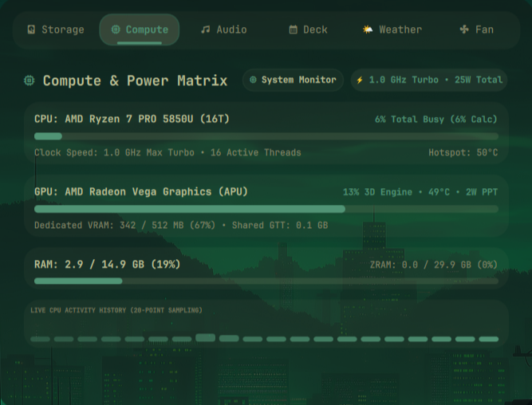
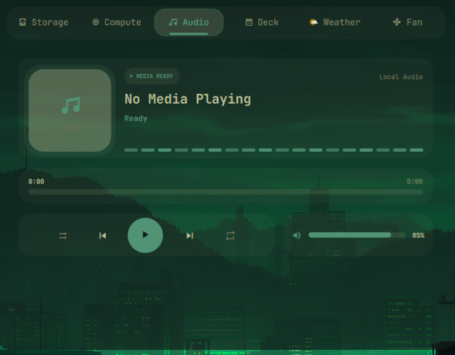
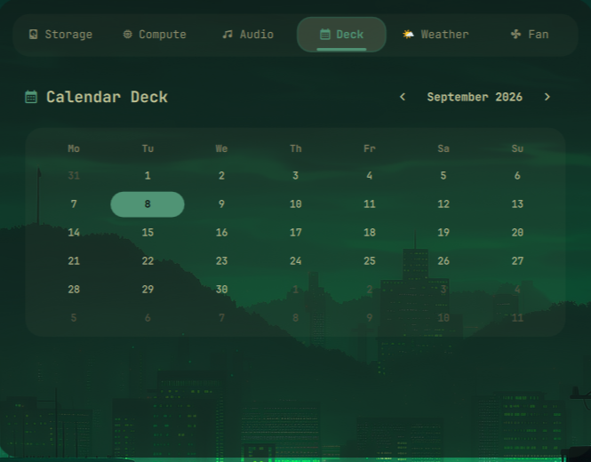
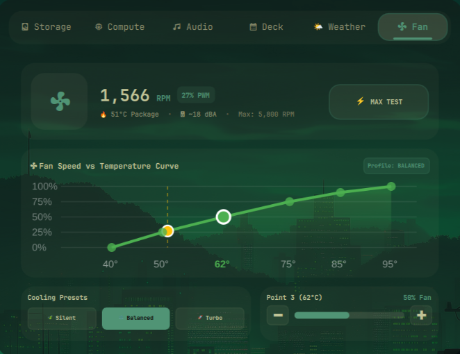
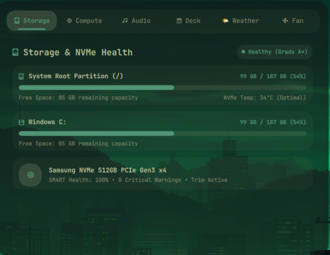
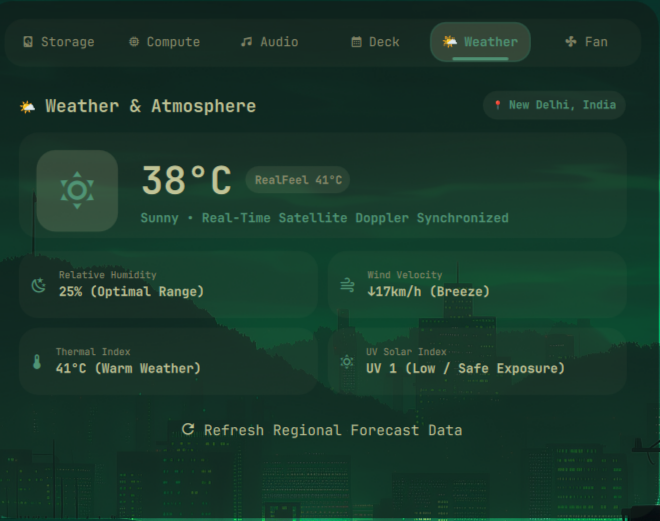

# System Pulse (`omarchy-system-pulse`)

> **Unofficial / Community Project**: Formerly Omni Center / System Plus. An independent open-source telemetry and control center for Omarchy.

A unified center-island hardware telemetry, audio control, and quick-action dashboard designed for Omarchy Quickshell and Hyprland.

---

## Status / Experimental Warning

System Pulse displays hardware metrics by reading standard Linux `/proc`, `/sys`, and D-Bus interfaces. **It does not claim universal hardware support.** Fan speeds, CPU temperature sensors, and battery telemetry vary significantly depending on hardware vendor, kernel drivers, and motherboard ACPI tables. Missing sensors are detected and handled gracefully without requiring root permissions.

---

## Features

- **Compute Telemetry**: Real-time CPU core utilization, load averages, memory consumption, and thermal readings where exposed by kernel drivers.
- **Storage Metrics**: Filesystem disk space usage and partition health.
- **Audio Control Center**: Master physical volume sliders, output sink selection, and MPRIS media player controls (play/pause/next/previous).
- **Audio Visualization (Optional)**: Lightweight audio spectrum visualization connecting to PipeWire / PulseAudio via `libpulse-simple` (compiled optionally from source).
- **Fan Controls & Profiles**: Fan speed telemetry and optional curve switching when supported hardware interfaces exist.
- **Weather Widget**: Optional lightweight weather summary fetched via `wttr.in`.
- **Center Island Placement**: Designed for the center section of the Omarchy top bar.

---

## Requirements

- **Operating System**: Arch Linux (rolling release, x86_64)
- **Desktop Shell**: Omarchy (`dev (13f18b2c) / 4.0.2`) with Quickshell (`0.3.1`)
- **Compositor**: Hyprland (`0.56.2`)
- **Core Dependencies**: `bash`, `jq`
- **Optional Dependencies**:
  - `pipewire`, `pipewire-pulse` (for audio routing and visualizer)
  - `playerctl` (for MPRIS media transport controls)
  - `lm_sensors` (for thermal sensors)
  - `curl` (for weather forecasts)
  - `gcc`, `libpulse` (for compiling optional audio spectrum visualizer)

---

## Compatibility

| Component | Tested Version | Compatibility Status |
|---|---|---|
| Omarchy | `dev (13f18b2c) / 4.0.2` | Fully compatible |
| Quickshell | `0.3.1` | Fully compatible |
| Hyprland | `0.56.2` | Fully compatible |
| Audio | PipeWire 1.6.8 / Pulse | Fully compatible |

---

## Installation

### Method 1: Using Omarchy Plugin Manager

```bash
omarchy plugin add https://github.com/YOUR-USERNAME/omarchy-system-pulse.git --enable
```

### Method 2: Using the Safe User Installer

```bash
git clone https://github.com/YOUR-USERNAME/omarchy-system-pulse.git
cd omarchy-system-pulse

./install.sh check
./install.sh install --dry-run
./install.sh install
```

---

## System Setup Before Installation

1. **Verify Audio and Sensors**:
   ```bash
   wpctl status       # PipeWire audio sink status
   sensors            # Verify hardware temperature sensors
   playerctl status   # Check active media players
   ```
2. **Never Requires Root**:
   System Pulse reads standard unprivileged sysfs paths (`/sys/class/hwmon`, `/sys/class/power_supply`). Do not run the shell or installer as root.

---

## Usage

- Click the center-bar widget to open the full System Pulse dashboard.
- Cycle through tabs: Compute, Storage, Audio, Deck, Fan, Weather.

---

## Configuration

- Center anchor placement in `~/.config/omarchy/shell.json`:
  ```json
  {
    "bar": {
      "centerAnchor": "daemon0.system-pulse",
      "layout": {
        "center": [
          { "id": "omarchy.indicators" },
          { "id": "daemon0.system-pulse" }
        ]
      }
    }
  }
  ```

---

## Update

```bash
omarchy plugin update daemon0.system-pulse
```

---

## Uninstall / Rollback

```bash
./install.sh uninstall
```

---

## Security and Privacy

- Telemetry is queried purely locally on your machine.
- Weather queries fetch city temperature via public HTTPS without tracking.
- No personal data or audio recording is logged or transmitted.

---

## Troubleshooting

- **Audio visualizer does not show activity**:
  Ensure `libpulse-simple` headers are installed (`sudo pacman -S libpulse`) and re-run `./install.sh install` to compile the spectrum helper. If omitted, all other cards work normally.
- **Fan speeds not visible**:
  Run `sensors-detect` to check if your motherboard provides standard `hwmon` fan sensors.

---

## Showcase

> Visual previews, UI screenshots, and recordings for documentation and release verification.

### Main experience

<!-- Future image: assets/showcase/system_plus_compute.png -->
<!--  -->

### Feature gallery

<!-- Future image: assets/showcase/system_plus_audio.png -->
<!--  -->

<!-- Future image: assets/showcase/system_plus_compute.png -->
<!--  -->

<!-- Future image: assets/showcase/system_plus_deck.png -->
<!--  -->

<!-- Future image: assets/showcase/system_plus_fan.png -->
<!--  -->

<!-- Future image: assets/showcase/system_plus_storage.png -->
<!--  -->

<!-- Future image: assets/showcase/system_plus_weather.png -->
<!--  -->

<!-- Future image: assets/showcase/feature-07.png -->
<!--  -->

<!-- Future image: assets/showcase/feature-08.png -->
<!--  -->

<!-- Future image: assets/showcase/feature-09.png -->
<!--  -->

<!-- Future image: assets/showcase/feature-10.png -->
<!--  -->

### Motion and interaction

<!-- Future GIF: assets/showcase/interaction-01.gif -->
<!--  -->

<!-- Future GIF: assets/showcase/interaction-02.gif -->
<!--  -->

### Video demonstrations

<!-- Future thumbnail: assets/showcase/video-01-thumbnail.png -->
<!-- [](https://github.com/YOUR-USERNAME/PROJECT-NAME/releases) -->


---

## Contributing

Issues and enhancements are welcome!

---

## License

[MIT License](LICENSE).
